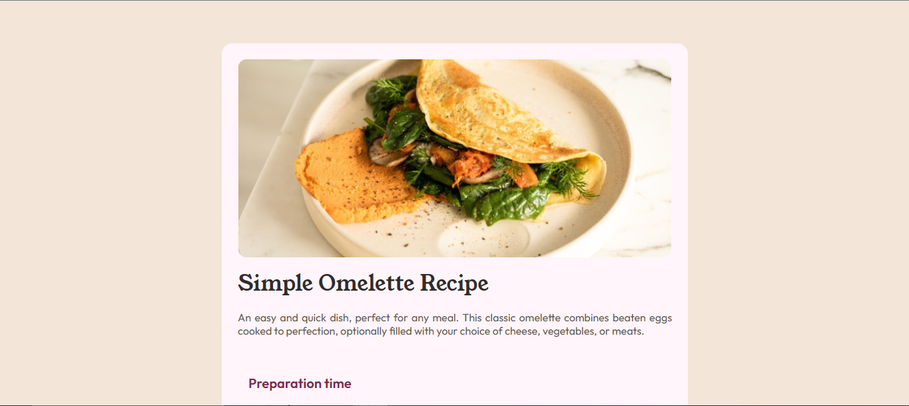

# Frontend Mentor - Recipe page solution

This is a solution to the [Recipe page challenge on Frontend Mentor](https://www.frontendmentor.io/challenges/recipe-page-KiTsR8QQKm). Frontend Mentor challenges help you improve your coding skills by building realistic projects. 

## Table of contents

- [Overview](#overview)
  - [The challenge](#the-challenge)
  - [Links](#links)
- [My process](#my-process)
  - [Built with](#built-with)
  - [What I learned](#what-i-learned)
  - [Continued development](#continued-development)
- [Author](#author)
- [Acknowledgments](#acknowledgments)

## Overview

### Links

- Solution URL: [Recipe Page](https://www.frontendmentor.io/solutions/recipe-page-htmlcss-830KxO2vWr)
- Live Site URL: [Recipe Page](https://maurodev35.github.io/Recipe-Page/)

## My process

For this time it was harder since I had to do the responsive so, I decided to focus on create the mobile view first then using the @media in order to apply the necessary changes for other views such as table and computer.

### Built with

- Semantic HTML5 markup
- CSS custom properties
- Flexbox
- Mobile-first workflow

### What I learned

I learned different ways of changing the color for the bulletpoints in the li as well as how to use flexbox in my favor in order to order different elements one in front of the other one.

### Continued development

I'll keep using the learning paths from Frontend Mentor in order to keep improving my skills in HTML, CSS and JavaScript

## Author

- Frontend Mentor - [@MauroDev35](https://www.frontendmentor.io/profile/MauroDev35)
- LinkedIn - [Andres Mauricio Paez Vergara](https://www.linkedin.com/in/maurodev35/)

